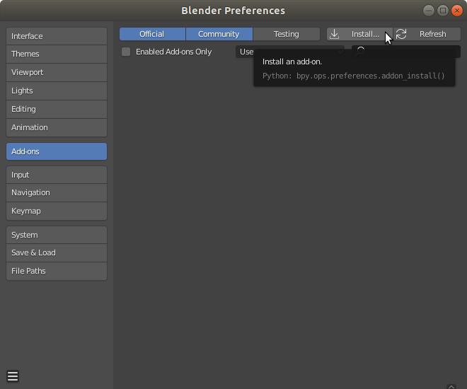
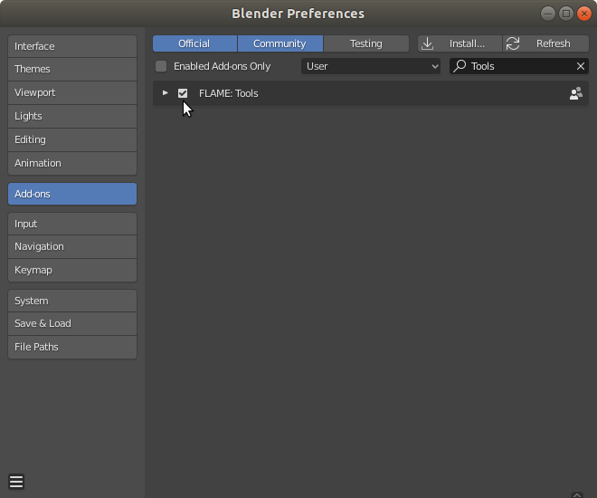

# FLAME Blender Add-on

[FLAME](http://flame.is.tue.mpg.de/) is a lightweight and expressive generic head model learned from over 33,000 of accurately aligned 3D scans. This add-on allows you to add gender specific FLAME skinned meshes to your current Blender scene. The imported FLAME meshes consist of shape keys (blend shapes) for shape, expression and pose correctives as well as joints for manipulation of neck, jaw and eyes.

#### Add-on features:
+ Add gender specific FLAME mesh to current scene
+ Randomize/reset shape
+ Randomize/reset expression
+ Update joint locations
+ Enable/disable corrective poseshapes
+ Pose neck and jaw joints
+ 3D printing support: Make mesh watertight and export at proper scale

Requirements: Blender 2.80+

Additional Dependencies: None

## Data

Download the FLAME Blender Add-on from [MPI-IS/FLAME](http://flame.is.tue.mpg.de/). You need to sign up and agree to the model license for access to the model.

## Installation
1. Blender>Edit>Preferences>Add-ons>Install



2. Select flame_tool add-on ZIP file and install

3. Enable FLAME add-on



4. Enable sidebar in 3D Viewport>View>Sidebar

5. FLAME tool will show up in sidebar


## Usage

### Add gender specific FLAME mesh
+ Select gender and press "Add to scene" button to add model to origin
    + Note: If you cannot see the mesh then make sure that you have removed the default Blender cube at the origin since it will cover the FLAME model


### Modify shape
You can modify the shape by selecting the FLAME mesh and then either clicking on the "Random head shape" button or by modifying the shape keys of the selected mesh.

### Modify expression
You can modify the expression by selecting the FLAME mesh and then either clicking on the "Random facial expression" button or by modifying the corresponding shape keys of the selected mesh.

### Update joint locations
If you modified the shape keys for shape and/or expression you should click on the "Update joint locations" button to recalculate the joint locations.

### Corrective pose blendshapes
If you modified the pose in the Blender Pose mode and you want to use corrective poseshapes then you should click on the "Set poseshapes for current pose" button to apply these pose-dependent deformations for the current pose.

### Change pose
The add-on pose sliders allow you to quickly pose neck and jaw of the model.
More detailed posing is possible in Blender Pose Mode. You have to select the FLAME2020 root object before being able to enter pose mode.

### Prepare and export for 3D printing
Select mesh and the click on the "Close mesh" button to close all holes in the mesh and make it watertight for proper slicing. Click on the "Export OBJ" button to export the model in [mm] scale for you slicing software.

## License

FLAME is available under [Creative Commons Attribution license](https://creativecommons.org/licenses/by/4.0/). By using the model or the code code, you acknowledge that you have read the license terms (http://flame.is.tue.mpg.de/model_license), understand them, and agree to be bound by them. If you do not agree with these terms and conditions, you must not use the code.

## Citing

When using this code in a scientific publication, please cite 
```
@article{FLAME:SiggraphAsia2017,
  title = {Learning a model of facial shape and expression from {4D} scans},
  author = {Li, Tianye and Bolkart, Timo and Black, Michael. J. and Li, Hao and Romero, Javier},
  journal = {ACM Transactions on Graphics, (Proc. SIGGRAPH Asia)},
  volume = {36},
  number = {6},
  year = {2017},
  url = {https://doi.org/10.1145/3130800.3130813}
}
```

## Acknowledgement

This FLAME Blender Add-on has been implemented by Joachim Tesch. We thank Joachim for implementing and distributing the Add-on.
